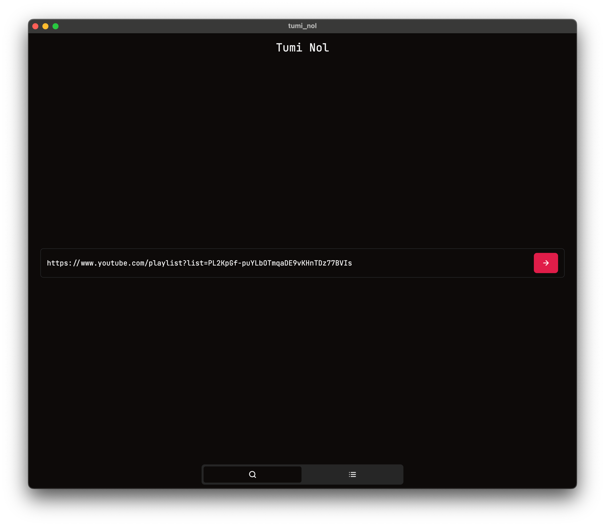
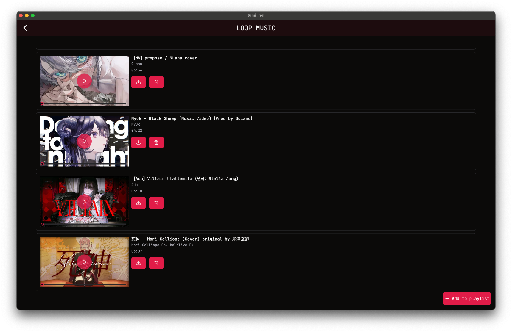
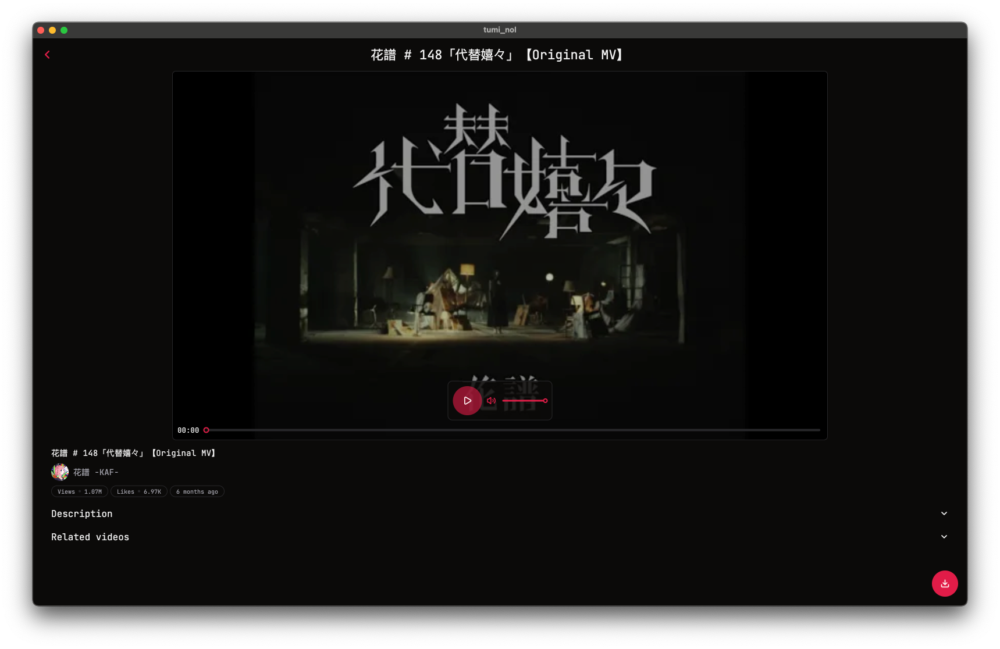
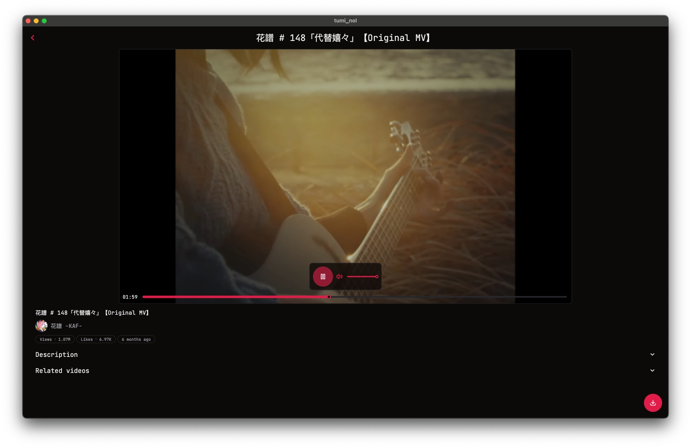

# Tumi Nol 🎵📺  

*A YouTube player & downloader built with Flutter.*

---

## 📖 About  

**Tumi Nol** is a Flutter-based app that lets you play and manage YouTube videos with ease.  
It aims to provide both online playback and offline playlist management in a simple, modern UI.  

---

## ✨ Features  

- ▶️ **Play YouTube videos** directly or from a playlist.  
- 📂 **Save playlists locally**  
  - Stored playlists automatically fetch new videos added on YouTube.  
  - *(Currently not fully implemented)*  
- 🎶 **Create local playlists** to save and organize your favorite videos.  
  - *(Todo)*  
- ⬇️ **Download YouTube videos** for offline viewing.  
  - *(Todo)*  

---

## 🚀 Tech Stack  

- **Framework:** [Flutter](https://flutter.dev)  
- **UI:** [ShadCN UI for Flutter](https://pub.dev/packages/shadcn_ui)  
- **State Management:** Riverpod
- **for YouTube:**  
  - `youtube_explode_dart`  

---

## 📌 Roadmap  

- [ ] Implement fully working auto-fetch for saved playlists.  
- [ ] Add local playlist creation & management.  
- [ ] Enable video downloads with multiple quality options.  
- [ ] Add theming and a modern UI polish with ShadCN UI.  
- [ ] Convert to a **native video player** for better performance.

---

## 🛠️ Getting Started  

### Prerequisites  

- Flutter SDK installed  
- Dart SDK installed  

### Installation  

1. Clone the repo

2. Get dependencies:  

   ```bash
   flutter pub get
   ```

3. Run the app:  

   ```bash
   flutter run
   ```

---

## 📷 Screenshots  









---

## 🤝 Contributing  

Contributions are welcome!  
Feel free to open issues or submit PRs to help improve **Tumi Nol**.  

---

## 📜 License  

This project is licensed under the [MIT License](LICENSE).  

---
